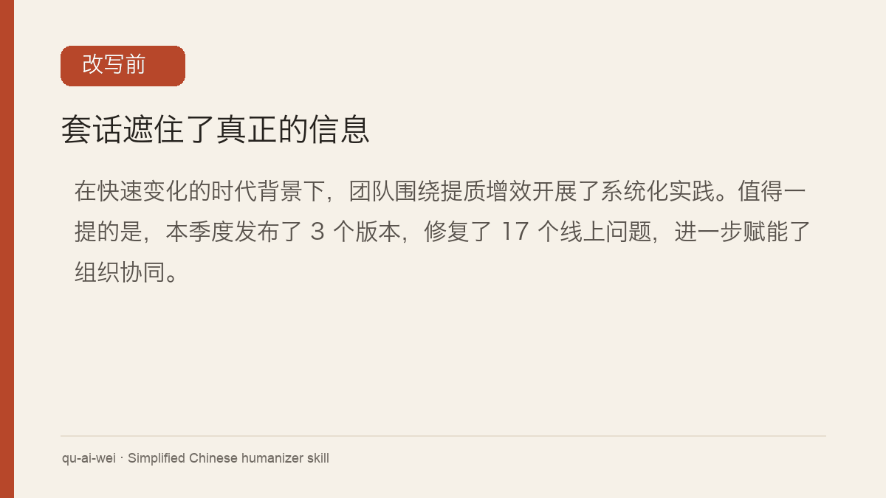

# 去 AI 味（qu-ai-wei）

[](https://github.com/LifelongLazyLearner/qu-ai-wei/releases/tag/v0.9.0)
[](./LICENSE)
[](#)
[](https://github.com/LifelongLazyLearner/qu-ai-wei/stargazers)

**把生硬、套路化的简体中文改得自然一点，同时保留事实、判断、正式程度和原文声口。**

qu-ai-wei 是一个简体中文改写 skill。它会重组句子、段落和长文的信息结构，清理套话、机械结构、翻译腔和过度工整的表达；不会替作者编观点、经历或细节，也不会把技术文档、公文和学术文字统一改成聊天口吻。

[看效果](#看效果) · [常见模式](#常见的中文-ai-味) · [30 秒上手](#30-秒上手) · [怎么工作](#怎么工作) · [使用边界](#使用边界)

语言：简体中文 | [English](./readmes/README.en.md) | [日本語](./readmes/README.ja.md) | [한국어](./readmes/README.ko.md) | [Español](./readmes/README.es.md)

## 看效果



### 删掉空话，数字不能跟着丢

**原文：** 在快速变化的时代背景下，团队围绕提质增效开展了系统化实践。值得一提的是，本季度发布了 3 个版本，修复了 17 个线上问题，进一步赋能了组织协同。

**终稿：** 团队本季度围绕提质增效开展了系统化实践，发布 3 个版本，修复了 17 个线上问题。

这里删掉了没有增加信息的背景、强调和口号，同时保留「系统化实践」这个原有判断，也没有补写原文未说明的措施或效果。更多边界案例见 [`references/examples.md`](./references/examples.md)。

### 技术文字不为“口语化”降格

**原文：** 在长上下文推理中，latency 会随 context window 扩展而变化，因此不能只用单一指标判断系统性能。

**终稿：** 长上下文推理的 latency 会随 context window 扩展而变化，不能只用单一指标判断系统性能。

技术词、因果关系和正式程度保持不变，只删没有作用的引入结构。

### 真人文字不乱改

**原文：** 我到楼下才想起来钥匙还在桌上。站了两秒，又觉得有点好笑——这周已经第二次了。

这类文字有具体经历、自嘲和自然节奏。只贴出文字、没有提出编辑要求时，qu-ai-wei 会停手；明确要求改写后，它可以调整结构，但仍会保留这些个人声口。

更多边界案例见 [`references/examples.md`](./references/examples.md)。

## 常见的中文 AI 味

下面是最容易被读者认出的 10 类结构。它们是编辑线索，不用于鉴定作者，也不是违禁词：单独出现一次通常不算问题；只有反复出现、脱离事实或让句子空转时才处理。

| 常见结构 | 什么时候值得改 | 什么时候要保留 |
|---|---|---|
| 随着……发展／在……背景下 | 开头只负责营造宏大感，删掉不影响信息 | 背景本身解释后文条件或时间 |
| 值得一提／不可否认 | 只强调，没有新增事实 | 确实承担转折、限定或作者判断 |
| 不是 X，而是 Y | 两端抽象、对称或反复出现，只把概念换个名字 | 两端确为不同动作时保留事实区别，但仍可改写句式 |
| 不仅 X，更 Y | 两端都在拔高同一件事 | 两端提供不同信息，确有递进关系 |
| 首先／其次／最后 | 个人叙述被硬拆成整齐三点 | 操作步骤、责任分工或答题结构 |
| 赋能／助力／打造／闭环 | 短段密集出现，却没有谁做了什么 | 行业固定用语或原文有明确对象 |
| 通过……的方式／由于……的原因 | 词更多，信息没有增加 | 删除后会改变条件、原因或正式程度 |
| 然而／此外／因此 | 段段用连接词，但句间没有对应关系 | 因果、转折或补充关系真实存在 |
| 重复代词、被字句、层层定语 | 主干被压住，像逐词翻译 | 被动能明确受事或责任，定语属于术语 |
| 全段同句长、同结构 | 每句都像从同一模板复制 | 公文、条款、步骤需要平行结构 |

完整的八个模式族见 [`references/pattern-catalog.md`](./references/pattern-catalog.md)；保护条件见 [`references/editing-boundaries.md`](./references/editing-boundaries.md)。

## 30 秒上手

电脑上已有 Node.js 和 npm 时，运行：

```bash
npx skills add https://github.com/LifelongLazyLearner/qu-ai-wei
```

`skills` 会自动检测本机支持的 AI 编程工具。安装后，新建会话或按工具要求重新加载 skills，然后直接说：

```text
帮我去 AI 味：

[粘贴简体中文]
```

## 怎么工作

qu-ai-wei 不按词表机械替换。每次处理都会按同一顺序检查：

1. 先检查疑似凭证、编辑授权和目标用途；用途会改变成稿却不明确时先提问。
2. 锁住数字、人物、时间、术语、引用、判断和责任关系，不允许改写后漂移。
3. 按目标语体扫描八个模式族，处理空话、机械对称、翻译腔、推论跳跃和格式残留。
4. 重新安排事实、解释、例子和结论的顺序；长文可以拆并段落、调整标题和章节。
5. 回读终稿，检查事实、因果、证据强度、引用绑定和原文声口是否保住。

完整执行规则见 [`SKILL.md`](./SKILL.md)，短案例见 [`references/examples.md`](./references/examples.md)。

## 只要终稿

默认模式会给出门检、终稿和简短打磨报告；存在实质逻辑风险时另列需作者确认。如果 qu-ai-wei 只是工作流中的一步，可以要求它只返回终稿正文：

```text
用 qu-ai-wei 改写下面的 PR 描述，只输出终稿正文：

[粘贴简体中文]
```

只输出终稿不会放宽事实和语体约束，也不会获得写文件、commit、发布或发送内容的权限。遇到真人文本或信息不足时，它仍会停手或提问。

## 支持的工具

qu-ai-wei 使用开放的 Agent Skills 格式。Codex、Claude Code、Kimi Code CLI、Cursor 和 OpenCode 等工具可以直接加载同一份 `SKILL.md` 和 `references/`；`agents/openai.yaml` 只为 Codex / ChatGPT 提供展示名称、简介和默认提示词。

需要明确安装目标时，可以运行：

```bash
npx skills add https://github.com/LifelongLazyLearner/qu-ai-wei -a codex -a claude-code -a kimi-code-cli
```

## 使用边界

- 只处理简体中文，不处理繁體中文。
- 不替用户翻译、从零写文章或补写原文没有的观点与经历。
- 不协助绕过学校、期刊或公司的 AI 使用规定。
- 不要粘贴密码、API key 或其他凭证；检测到疑似凭证时，skill 会停止并要求先脱敏。

> **0.x 开发版（当前 [v0.9.0](https://github.com/LifelongLazyLearner/qu-ai-wei/releases/tag/v0.9.0)）：** qu-ai-wei 仍在迭代，规则、分类、调用方式和输出格式可能变动。最新发布版本见 [Releases](https://github.com/LifelongLazyLearner/qu-ai-wei/releases)；欢迎提交 [issue](https://github.com/LifelongLazyLearner/qu-ai-wei/issues)、[discussion](https://github.com/LifelongLazyLearner/qu-ai-wei/discussions) 或 PR。

## 来源与许可

方法受 [humanizer](https://github.com/blader/humanizer) 启发，中文翻译腔规则参考 [yage.ai](https://yage.ai/share/ai-chinese-translationese-20260418.html)。本项目采用 [MIT License](./LICENSE)。
